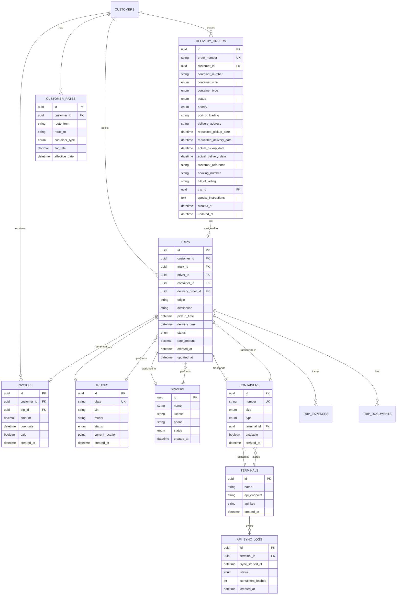
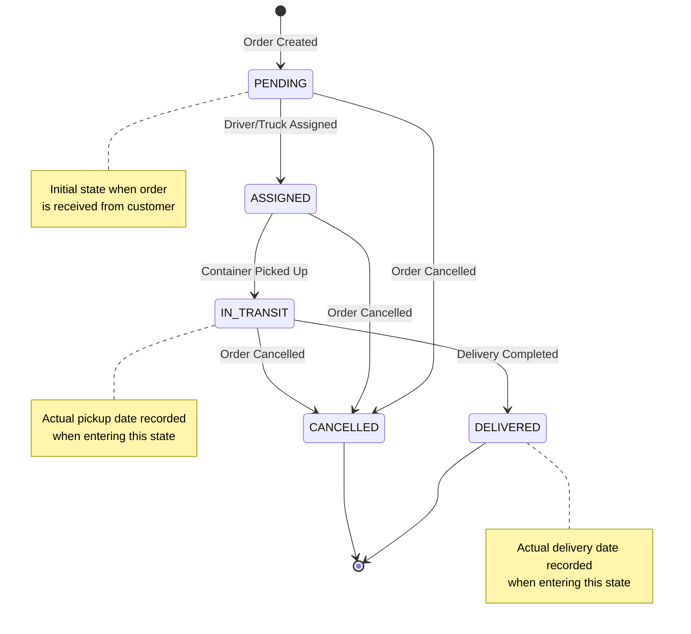
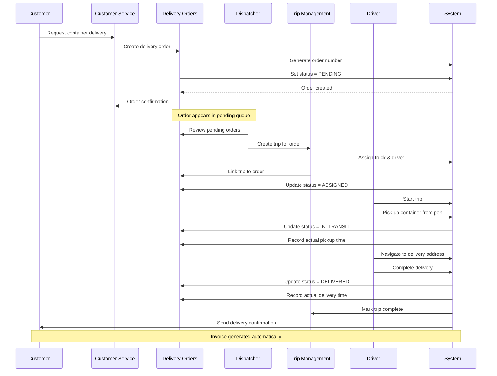
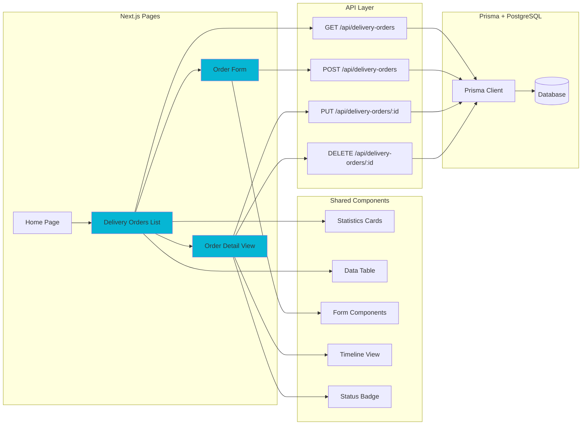
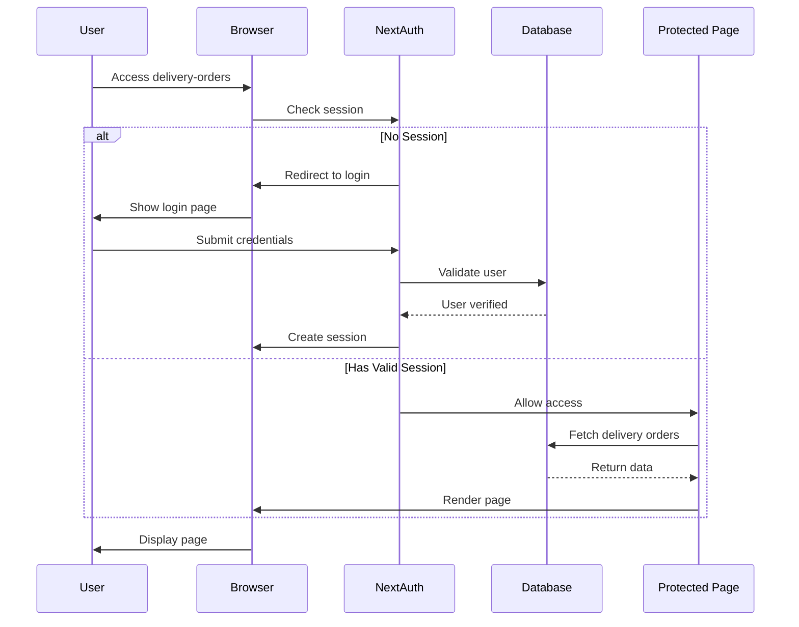
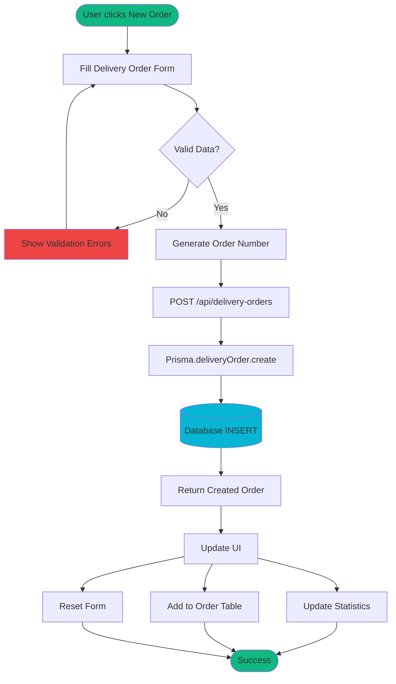
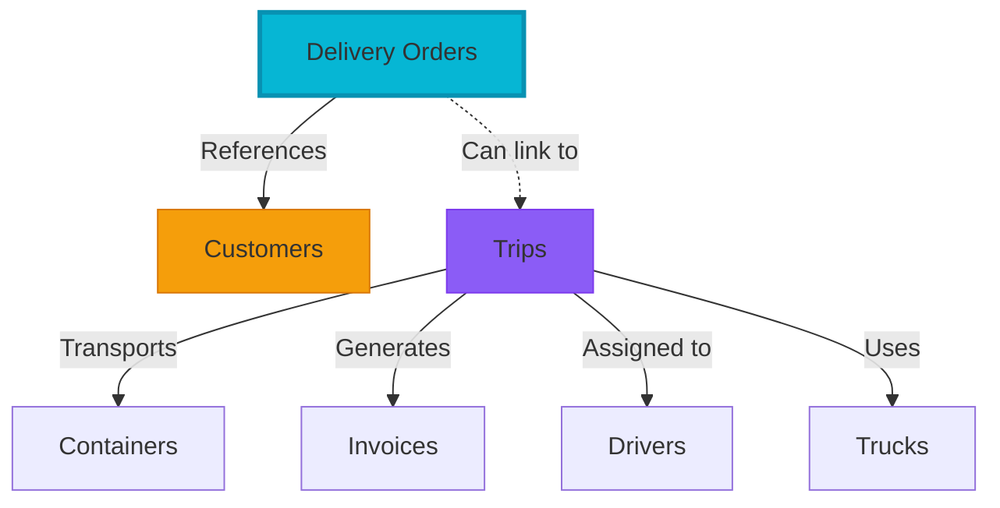
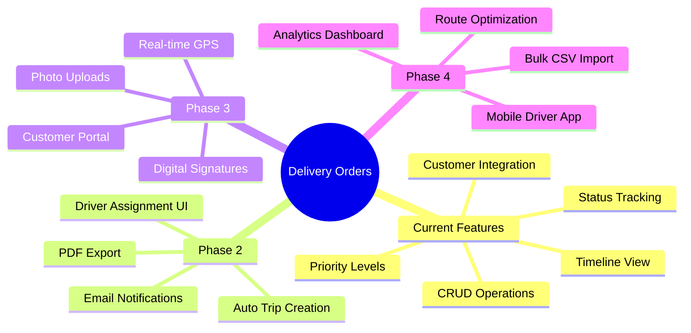
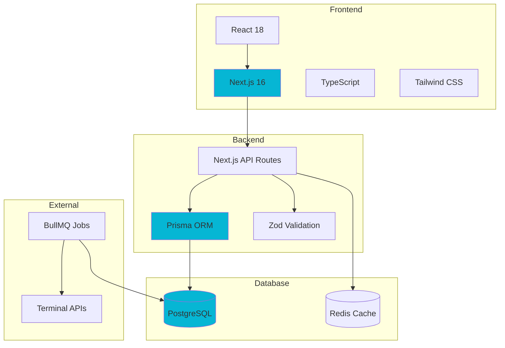

# Danube Logistics - System Diagrams

## 📊 Entity Relationship Diagram



---

## 🔄 Delivery Order Status Flow



---

## 🚚 Complete Delivery Order Workflow



---

## 🏗️ System Architecture with Delivery Orders

```mermaid
flowchart TB
    subgraph Browser["Browser Layer"]
        UI[Next.js Frontend]
        DOPage[Delivery Orders Page]
        Dashboard[Dispatch Dashboard]
        TripPage[Trip Management]
    end

    subgraph Server["Next.js Server"]
        API[API Routes]
        DOAPI[/api/delivery-orders]
        TripAPI[/api/trips]
        SA[Server Actions]
    end

    subgraph Database["PostgreSQL"]
        DOTable[(delivery_orders)]
        TripTable[(trips)]
        CustomerTable[(customers)]
        ContainerTable[(containers)]
    end

    subgraph Queue["Background Jobs"]
        BullMQ[BullMQ Queue]
        Sync[Terminal Sync Worker]
        Invoice[Invoice Generator]
    end

    UI --> API
    DOPage --> DOAPI
    Dashboard --> API
    TripPage --> TripAPI

    DOAPI --> DOTable
    TripAPI --> TripTable
    DOAPI --> CustomerTable
    TripAPI --> ContainerTable

    DOTable -.Link.- TripTable
    DOTable -.Reference.- CustomerTable

    BullMQ --> Sync
    BullMQ --> Invoice
    Sync --> ContainerTable
    Invoice --> TripTable

    style DOTable fill:#06b6d4
    style DOPage fill:#06b6d4
    style DOAPI fill:#06b6d4
```

---

## 📱 Component Architecture



---

## 🔐 Authentication & Authorization Flow



---

## 📊 Data Flow: Creating a Delivery Order



---

## 🗂️ File Structure

```
src/
├── app/
│   ├── page.tsx                          # Home page with nav tiles
│   ├── delivery-orders/
│   │   ├── page.tsx                      # List & Create orders
│   │   └── [id]/
│   │       └── page.tsx                  # Order detail & status updates
│   ├── trips/
│   │   └── page.tsx                      # Trip management
│   ├── api/
│   │   ├── delivery-orders/
│   │   │   ├── route.ts                  # GET, POST endpoints
│   │   │   └── [id]/
│   │   │       └── route.ts              # GET, PUT, DELETE endpoints
│   │   └── trips/
│   │       └── route.ts                  # Trip API
│   └── layout.tsx
├── lib/
│   └── prisma.ts                         # Prisma client singleton
└── prisma/
    ├── schema.prisma                     # Database schema
    └── migrations/
        └── add_delivery_orders.sql       # Migration file
```

---

## 🎨 UI Component Hierarchy

```
DeliveryOrdersPage
├── Header
│   ├── Title & Description
│   ├── Home Button
│   └── New Order Button
├── Statistics Cards
│   ├── Total Orders
│   ├── Pending
│   ├── In Transit
│   └── Delivered
├── Order Form (conditional)
│   ├── Customer Select
│   ├── Container Details
│   ├── Location Inputs
│   ├── Date Pickers
│   ├── Reference Fields
│   └── Submit/Cancel Buttons
└── Orders Table
    ├── Table Header
    ├── Table Body
    │   └── Order Rows
    │       ├── Order Number
    │       ├── Customer Name
    │       ├── Container Info
    │       ├── Route
    │       ├── Delivery Date
    │       ├── Status Badge
    │       ├── Priority Badge
    │       └── Action Buttons
    │           ├── View
    │           ├── Edit
    │           └── Delete
    └── Empty State (if no orders)
```

---

## 🔄 Integration Points



---

## 📈 Future Enhancements



---

## 🎯 Technology Stack Diagram



---

*Last Updated: February 2026*
*Delivery Orders Feature: v1.0.0*
