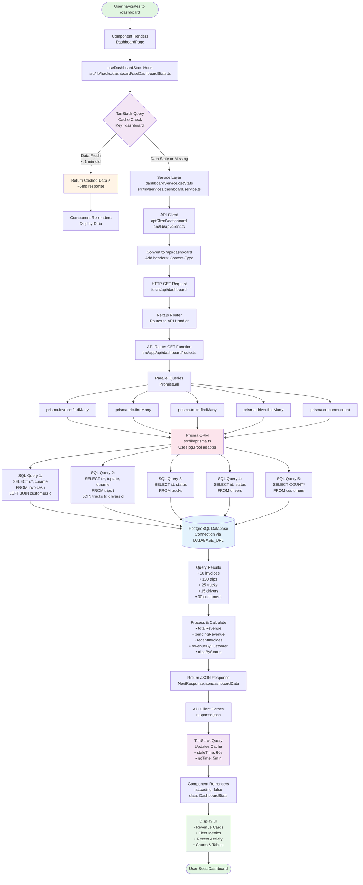
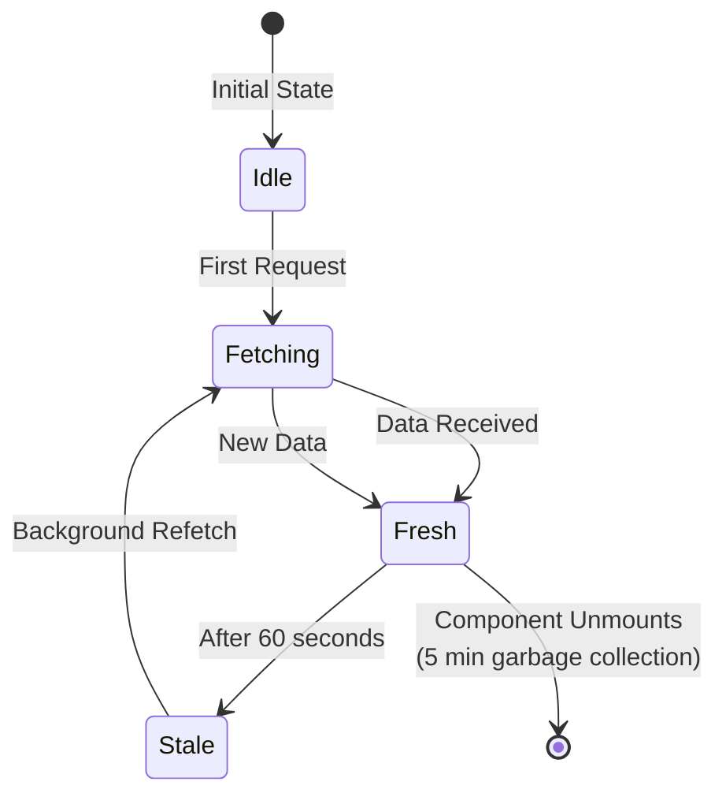
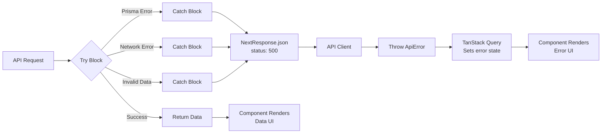

# Data Flow Diagram - Danube Logistics

## Complete Request Flow: Browser → Database → Response



## Flow Steps Breakdown

### Frontend Layer (Browser)

| Step | Component | File | Action |
|------|-----------|------|--------|
| 1 | Page Component | `src/app/dashboard/page.tsx` | User navigates, component renders |
| 2 | Custom Hook | `src/lib/hooks/dashboard/useDashboardStats.ts` | Call `useDashboardStats()` |
| 3 | TanStack Query | In-memory cache | Check if data exists & is fresh |
| 4a | Cache Hit | - | Return data instantly (5ms) ⚡ |
| 4b | Cache Miss | - | Proceed to network request |

### Service Layer (API Call)

| Step | Component | File | Action |
|------|-----------|------|--------|
| 5 | Service | `src/lib/services/dashboard.service.ts` | Call `dashboardService.getStats()` |
| 6 | API Client | `src/lib/api/client.ts` | Prepare fetch request |
| 7 | HTTP Request | Browser fetch API | `GET /api/dashboard` |

### Backend Layer (Server)

| Step | Component | File | Action |
|------|-----------|------|--------|
| 8 | Next.js Router | Built-in | Route to API handler |
| 9 | API Route | `src/app/api/dashboard/route.ts` | Execute `GET()` function |
| 10 | Parallel Queries | Prisma ORM | 5 queries with `Promise.all()` |

### Database Layer

| Step | Component | File | Action |
|------|-----------|------|--------|
| 11 | Prisma Client | `src/lib/prisma.ts` | Translate to SQL queries |
| 12 | pg.Pool | Node-postgres | Connect to PostgreSQL |
| 13 | PostgreSQL | Database Server | Execute 5 SQL queries |
| 14 | Results | - | Return result sets |

### Response Layer

| Step | Component | File | Action |
|------|-----------|------|--------|
| 15 | Processing | `src/app/api/dashboard/route.ts` | Calculate metrics |
| 16 | JSON Response | Next.js | Return `NextResponse.json()` |
| 17 | API Client | `src/lib/api/client.ts` | Parse response |
| 18 | Cache Update | TanStack Query | Store in cache |
| 19 | Re-render | `src/app/dashboard/page.tsx` | Display data |

---

## Detailed Flow with Code References

### 1️⃣ User Action → Component Render

```typescript
// src/app/dashboard/page.tsx:6-7
export default function DashboardPage() {
  const { data: stats, isLoading, error } = useDashboardStats();
```

### 2️⃣ Hook Execution

```typescript
// src/lib/hooks/dashboard/useDashboardStats.ts:6-10
export function useDashboardStats() {
  return useQuery({
    queryKey: DASHBOARD_QUERY_KEY,  // ['dashboard']
    queryFn: dashboardService.getStats,
  });
}
```

### 3️⃣ Cache Check (TanStack Query)

```
IF cache['dashboard'] exists AND age < 60 seconds:
  ✅ Return cached data (FAST PATH)
ELSE:
  ⏩ Execute queryFn (SLOW PATH)
```

### 4️⃣ Service Layer Call

```typescript
// src/lib/services/dashboard.service.ts:4-6
export const dashboardService = {
  getStats: () => apiClient<DashboardStats>('/dashboard'),
};
```

### 5️⃣ API Client Request

```typescript
// src/lib/api/client.ts:12-24
export async function apiClient<T>(endpoint: string, options?: RequestInit): Promise<T> {
  const url = `/api${endpoint}`;  // '/api/dashboard'

  const response = await fetch(url, {
    headers: { 'Content-Type': 'application/json', ...options?.headers },
    ...options,
  });

  return response.json();
}
```

### 6️⃣ Next.js Routes to Handler

```
Request: GET /api/dashboard
↓
Next.js Router
↓
File: src/app/api/dashboard/route.ts → GET() function
```

### 7️⃣ Parallel Database Queries

```typescript
// src/app/api/dashboard/route.ts:7-61
const [invoices, trips, trucks, drivers, customers] = await Promise.all([
  prisma.invoice.findMany({ include: { customer } }),  // Query 1
  prisma.trip.findMany({ include: { truck, driver } }), // Query 2
  prisma.truck.findMany({ select: { status } }),        // Query 3
  prisma.driver.findMany({ select: { status } }),       // Query 4
  prisma.customer.count(),                              // Query 5
]);
```

### 8️⃣ Prisma → SQL Translation

```typescript
// src/lib/prisma.ts:11-14
const pool = new pg.Pool({
  connectionString: process.env.DATABASE_URL
});

const adapter = new PrismaPg(pool);
const prisma = new PrismaClient({ adapter });
```

**Generated SQL:**

```sql
-- Query 1: Invoices with customer names
SELECT
  i.id, i.invoice_number, i.total_amount, i.paid, i.created_at,
  c.name as customer_name
FROM invoices i
LEFT JOIN customers c ON i.customer_id = c.id
ORDER BY i.created_at DESC;

-- Query 2: Trips with truck, driver, customer
SELECT
  t.id, t.status, t.pickup_location, t.dropoff_location,
  tr.plate as truck_plate,
  d.name as driver_name,
  c.name as customer_name
FROM trips t
LEFT JOIN trucks tr ON t.truck_id = tr.id
LEFT JOIN drivers d ON t.driver_id = d.id
LEFT JOIN customers c ON t.customer_id = c.id
ORDER BY t.created_at DESC;

-- Query 3: Truck statuses
SELECT id, status FROM trucks;

-- Query 4: Driver statuses
SELECT id, status FROM drivers;

-- Query 5: Customer count
SELECT COUNT(*) FROM customers;
```

### 9️⃣ Process Results

```typescript
// src/app/api/dashboard/route.ts:63-158
const totalRevenue = invoices
  .filter(inv => inv.paid)
  .reduce((sum, inv) => sum + parseFloat(inv.totalAmount.toString()), 0);

const recentInvoices = invoices.slice(0, 5).map(inv => ({
  id: inv.id,
  invoiceNumber: inv.invoiceNumber,
  customerName: inv.customer.name,
  totalAmount: parseFloat(inv.totalAmount.toString()),
  paid: inv.paid,
  createdAt: inv.createdAt.toISOString(),
}));

const dashboardData = {
  totalRevenue,
  pendingRevenue,
  totalTrips,
  activeTrips,
  completedTrips,
  totalTrucks,
  availableTrucks,
  totalDrivers,
  activeDrivers,
  totalCustomers: customers,
  recentInvoices,
  recentTrips,
  revenueByCustomer,
  tripsByStatus,
};

return NextResponse.json(dashboardData);
```

### 🔟 Cache & Render

```typescript
// TanStack Query automatically:
// 1. Receives response
// 2. Updates cache: { ['dashboard']: dashboardData }
// 3. Sets staleTime: 60 seconds
// 4. Triggers component re-render

// Component receives data:
const { data: stats, isLoading, error } = useDashboardStats();
// stats = DashboardStats object
// isLoading = false
// error = null
```

---

## Performance Metrics

| Scenario | Time | Path |
|----------|------|------|
| **First Load** | 200-500ms | Full flow: Component → API → DB → Response |
| **Cache Hit** | ~5ms | Component → TanStack Query → Cached Data ⚡ |
| **Background Refetch** | 0ms perceived | Show stale data instantly, fetch in background |
| **Parallel Queries** | ~100-200ms | 5 queries run simultaneously, not sequentially |

---

## Type Safety Flow

```typescript
// Type flows through entire chain:

interface DashboardStats { /* ... */ }  // src/lib/types/dashboard.types.ts
           ↓
dashboardService.getStats() → Promise<DashboardStats>
           ↓
apiClient<DashboardStats>('/dashboard')
           ↓
useQuery<DashboardStats>({ queryFn: ... })
           ↓
const { data: stats } = useDashboardStats()  // stats: DashboardStats | undefined
```

---

## Cache States



---

## Error Handling Flow



---

**Generated:** 2026-02-10
**Diagram Tool:** Mermaid.js
**For:** Danube Logistics Architecture Documentation
